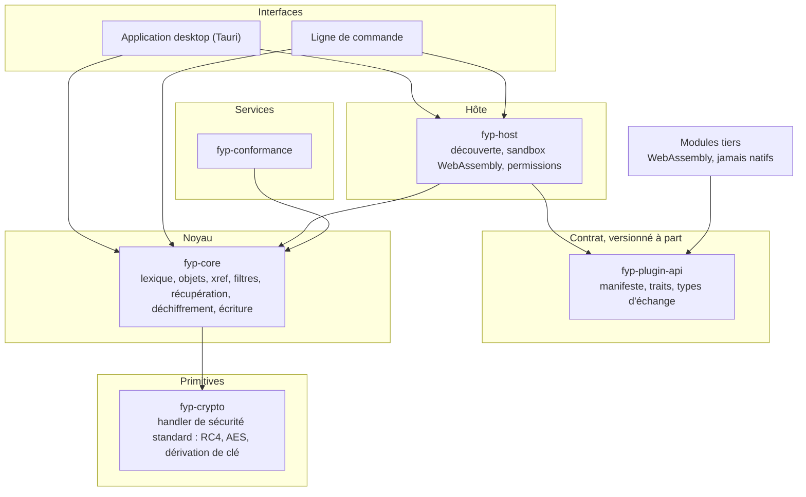
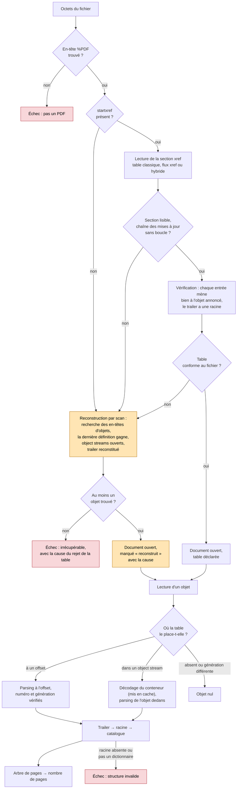
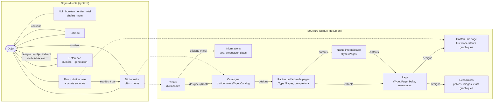
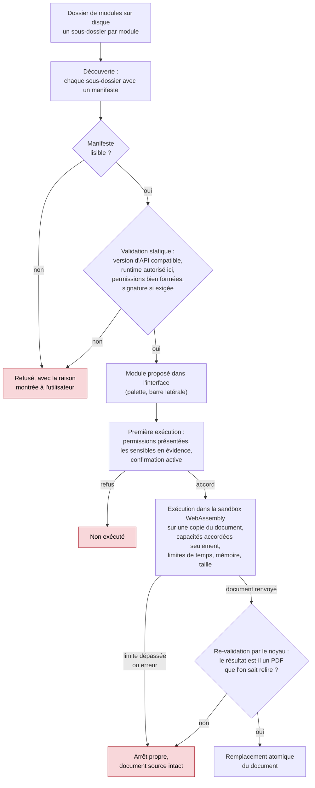

# Diagrammes

> **Règle de maintenance.** Ces diagrammes ne montrent que ce qui change
> lentement : couches, étapes, rôles, relations. Jamais de nom de méthode,
> de signature ni de champ précis. Un diagramme qui citerait `foo()` serait
> faux au premier renommage ; un diagramme qui dit « le noyau vérifie la
> table déclarée avant de la croire » reste vrai tant que le principe tient.
> Quand un principe change, on met le diagramme à jour ; quand un nom
> change, on ne touche à rien. Les détails vivent dans `architecture.md` et
> dans la documentation du code.

## 1. Couches et dépendances autorisées

Ce diagramme répond à la question « qui a le droit de dépendre de qui ? ».
C'est la vue d'ensemble de `architecture.md`, avec les flèches de dépendance
telles que les manifestes Cargo les déclarent. Toutes vont vers le bas : le
noyau ne connaît ni l'hôte, ni les modules, ni l'interface ; le contrat des
modules ne connaît pas le noyau ; un module tiers ne voit que le contrat.
Avant d'ajouter une dépendance entre deux crates, vérifier qu'une flèche
existe ici dans ce sens.

Le contrat (`fyp-plugin-api`) n'a aucune flèche sortante vers le reste du
projet : c'est ce qui permet de le publier et de le versionner seul.

## 2. Parcours d'un fichier à l'ouverture

Ce diagramme répond à la question « que se passe-t-il entre un tableau
d'octets et un nombre de pages, et où le noyau peut-il échouer ou se
rattraper ? ». Le principe : on essaie d'abord le chemin déclaré par le
fichier, on le vérifie, et l'on ne passe à la reconstruction par scan qu'en
recours. Un fichier réparé reste marqué comme tel jusqu'au bout. Les
losanges sont les points de décision, les nœuds rouges les échecs
définitifs, le nœud orange la récupération.

Deux garde-fous ne figurent pas comme étapes mais s'appliquent partout :
tout décodage de flux est plafonné (protection contre les bombes de
décompression) et le scan a un budget de travail linéaire en la taille du
fichier.

## 3. Le modèle objet et la structure logique d'un document

Ce diagramme répond à la question « comment les briques syntaxiques
(ISO 32000-2, 7.3) forment-elles un document (7.7) ? ». À gauche, les dix
sortes d'objets directs et leurs relations de contenance : un tableau et un
dictionnaire contiennent des objets, un flux est un dictionnaire plus des
octets encodés, une référence désigne un objet indirect par numéro et
génération. À droite, le chemin logique que le noyau suit pour passer du
trailer aux pages ; chaque flèche « désigne » est, dans le fichier, une
référence. Le même modèle sert à la lecture et à l'écriture : le writer ne
fait que sérialiser ces briques.

Les objets indirects peuvent être stockés à un offset du fichier ou
compressés dans un object stream ; cette différence de stockage n'apparaît
pas dans le modèle : c'est la table xref qui la connaît, et le writer la
gomme en réécrivant tout au premier niveau.

## 4. Cycle de vie d'un module

Ce diagramme répond à la question « par quelles portes passe un module
tiers avant que son résultat soit accepté ? ». Il met en ordre les six
étapes de l'ADR 0003 : découverte, parsing, validation statique,
présentation des permissions, exécution sous sandbox, re-validation. Un
module hostile est l'hypothèse par défaut : chaque étape peut le rejeter, et
le document source n'est jamais modifié en place. La découverte et la
validation existent dans l'hôte ; l'exécution sandboxée et la re-validation
sont le programme du jalon 0.2.

Un module natif suit le même chemin sauf la sandbox : il n'est accepté que
depuis le dépôt, revu, et l'hôte refuse tout manifeste `native` venu
d'ailleurs.
